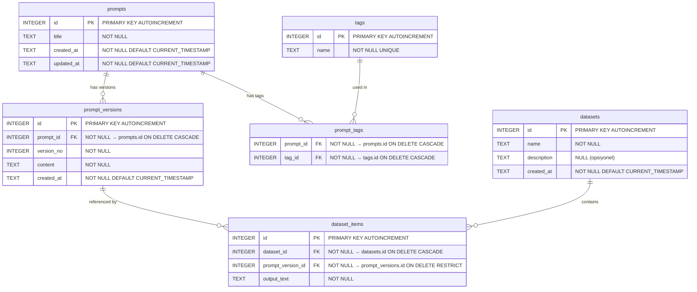

# Veritabanı Şeması — AI Prompt & Dataset Studio

## ER Diyagramı (Entity-Relationship)

## Tablo Detayları

### 1. `prompts` — Prompt Kayıtları

Her prompt bir başlık (`title`) ile tanımlanır. İçerik prompt'un kendisinde değil, versiyonlarında (`prompt_versions`) tutulur.

| Sütun | Tip | Kısıt | Açıklama |
|---|---|---|---|
| `id` | INTEGER | PRIMARY KEY AUTOINCREMENT | Benzersiz kimlik |
| `title` | TEXT | NOT NULL | Prompt başlığı |
| `created_at` | TEXT | NOT NULL, DEFAULT CURRENT_TIMESTAMP | Oluşturulma zamanı (ISO 8601) |
| `updated_at` | TEXT | NOT NULL, DEFAULT CURRENT_TIMESTAMP | Son güncellenme zamanı (ISO 8601) |

### 2. `prompt_versions` — Prompt Versiyonları

Her prompt'un birden fazla versiyonu olabilir. `version_no` aynı prompt içinde otomatik artan bir numaradır.

| Sütun | Tip | Kısıt | Açıklama |
|---|---|---|---|
| `id` | INTEGER | PRIMARY KEY AUTOINCREMENT | Benzersiz kimlik |
| `prompt_id` | INTEGER | NOT NULL, FK → prompts.id | Ait olduğu prompt |
| `version_no` | INTEGER | NOT NULL | Versiyon numarası (prompt başına artan) |
| `content` | TEXT | NOT NULL | Prompt içeriği (bu versiyondaki metin) |
| `created_at` | TEXT | NOT NULL, DEFAULT CURRENT_TIMESTAMP | Versiyon oluşturulma zamanı |

**UNIQUE kısıtı:** `(prompt_id, version_no)` — aynı prompt için aynı versiyon numarası tekrarlanamaz.

### 3. `tags` — Etiketler

| Sütun | Tip | Kısıt | Açıklama |
|---|---|---|---|
| `id` | INTEGER | PRIMARY KEY AUTOINCREMENT | Benzersiz kimlik |
| `name` | TEXT | NOT NULL, UNIQUE | Etiket adı (tekrarsız) |

### 4. `prompt_tags` — Prompt-Etiket İlişkisi (Çoka-Çok)

Bir prompt birden fazla etikete, bir etiket birden fazla prompt'a sahip olabilir.

| Sütun | Tip | Kısıt | Açıklama |
|---|---|---|---|
| `prompt_id` | INTEGER | NOT NULL, FK → prompts.id | Prompt kimliği |
| `tag_id` | INTEGER | NOT NULL, FK → tags.id | Etiket kimliği |

**PRIMARY KEY:** `(prompt_id, tag_id)` — aynı prompt-etiket çifti tekrarlanamaz.

### 5. `datasets` — Veri Setleri

| Sütun | Tip | Kısıt | Açıklama |
|---|---|---|---|
| `id` | INTEGER | PRIMARY KEY AUTOINCREMENT | Benzersiz kimlik |
| `name` | TEXT | NOT NULL | Veri seti adı |
| `description` | TEXT | — | Açıklama (opsiyonel) |
| `created_at` | TEXT | NOT NULL, DEFAULT CURRENT_TIMESTAMP | Oluşturulma zamanı |

### 6. `dataset_items` — Veri Seti Öğeleri

Her öğe bir prompt versiyonunu ve ona karşılık gelen model çıktısını (`output_text`) içerir.

| Sütun | Tip | Kısıt | Açıklama |
|---|---|---|---|
| `id` | INTEGER | PRIMARY KEY AUTOINCREMENT | Benzersiz kimlik |
| `dataset_id` | INTEGER | NOT NULL, FK → datasets.id | Ait olduğu veri seti |
| `prompt_version_id` | INTEGER | NOT NULL, FK → prompt_versions.id | Referans verilen prompt versiyonu |
| `output_text` | TEXT | NOT NULL | Model çıktısı / beklenen yanıt |

---

## ON DELETE Davranışları ve Gerekçeleri

| İlişki | ON DELETE | Gerekçe |
|---|---|---|
| `prompt_versions.prompt_id → prompts` | **CASCADE** | Bir prompt silindiğinde versiyonları da anlamsız kalır; hepsi birlikte silinmeli. |
| `prompt_tags.prompt_id → prompts` | **CASCADE** | Prompt silinince etiket ilişkileri de temizlenmeli. |
| `prompt_tags.tag_id → tags` | **CASCADE** | Etiket silinince ilişkileri de temizlenmeli. |
| `dataset_items.dataset_id → datasets` | **CASCADE** | Veri seti silindiğinde içindeki öğeler de silinmeli. |
| `dataset_items.prompt_version_id → prompt_versions` | **RESTRICT** | Bir prompt versiyonu herhangi bir veri setinde kullanılıyorsa silinememeli — veri seti bütünlüğünü korur. Önce dataset_item kaldırılmalı. |
